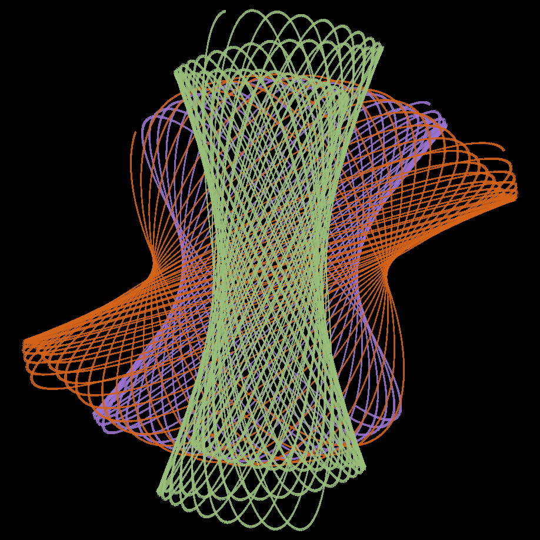
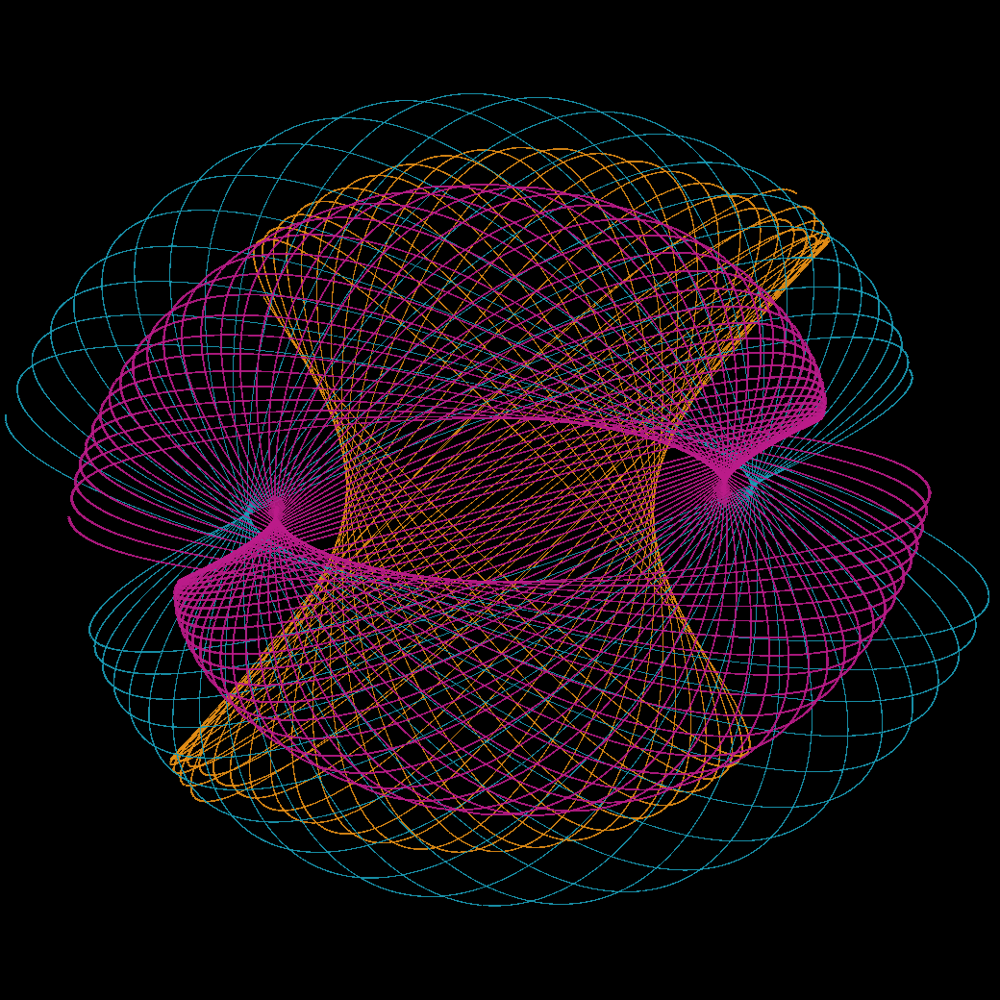
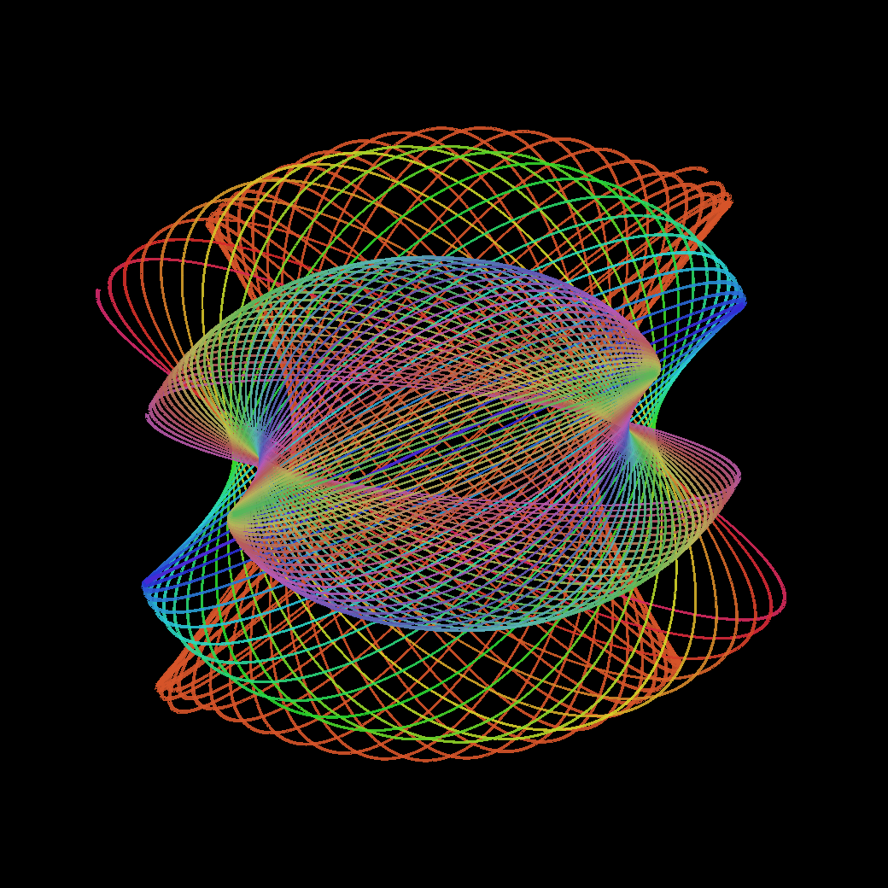
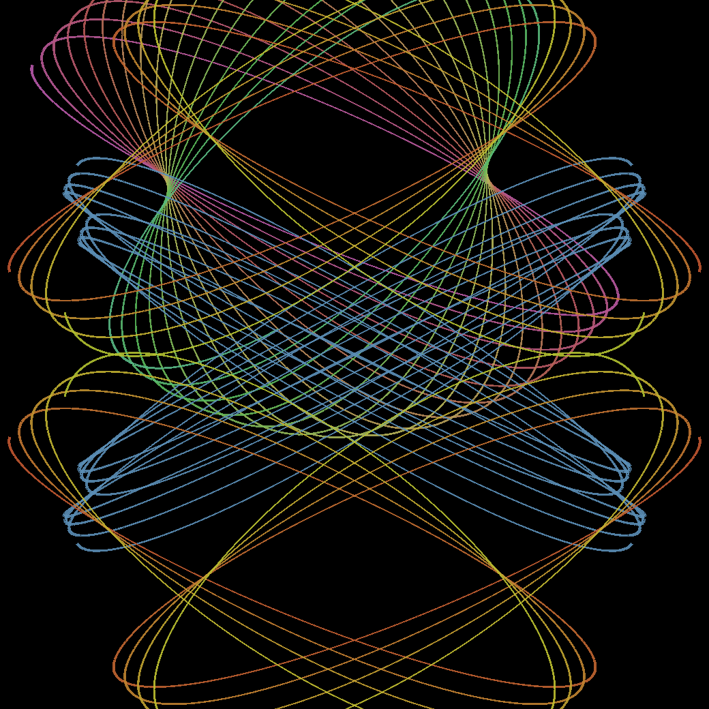

# Pendulum Art

A browser-based physics simulator that lets you create generative art the way a real paint pendulum does — a weighted bucket swinging on a string over a canvas, tracing precessing elliptical webs as it slowly winds down.

**[Try it live →](https://joanitad.github.io/pendulum-art/)**

---

## Examples

<table>
  <tr>
    <td></td>
    <td></td>
  </tr>
  <tr>
    <td></td>
    <td></td>
  </tr>
</table>

---

## How to make something beautiful

### The basics

1. **Pick a color** from the palette at the top of the panel
2. **Click CREATE** — the pendulum starts swinging and drawing immediately
3. **Watch the pattern emerge** — the ellipse slowly rotates as it shrinks, weaving a web
4. **Hit STOP when it looks right** — the pendulum glides gracefully to rest rather than cutting off abruptly
5. **Hit + NEW LAYER** — keep the drawing on the canvas and start a new swing on top with different settings
6. **SAVE ART** — downloads your piece as a PNG

### Controls

| Control | What it does |
|---|---|
| **Length** | Size of the arc — short strings make tight webs, long strings fill the canvas |
| **Weight** | Line thickness — thicker lines feel more like paint, thinner like wire |
| **Direction** | Angle the pendulum is pulled back before release — rotates the whole pattern |
| **Speed** | How fast time runs — slow is meditative, fast lets you explore quickly |
| **Color shift** | The line slowly rotates through hues as it draws — great for rainbow webs |
| **Mirror** | Reflects the drawing across both axes simultaneously — instant mandala |

### Moving the pivot

**Click or drag anywhere on the canvas** to move where the pendulum hangs from. The faint ghost preview shows where the next pattern will land before you commit. Use this to layer webs at different positions.

### Tips for great results

- **Layer 3–4 colors** using + NEW LAYER — each swing is slightly different so they interleave naturally
- **Turn on Color Shift** for a single run and let it go a long time — the hue rotation creates depth without manual layering  
- **Turn on Mirror** and move the pivot off-center — the four reflected copies create unexpected symmetry
- **Hit SURPRISE ME** to randomize everything — a good way to discover settings you wouldn't have tried
- **Let it run longer than feels right** — the densest, most intricate webs only emerge after many orbits
- **UNDO LAYER** removes the last run without clearing everything, so layering is risk-free

### Canvas color

Choose between dark (shows colors most vividly), muted grey, and warm parchment using the Canvas row — or pick any custom color with the wheel. You can change the canvas color even after drawing; strokes are stored separately and re-composite instantly.

---

## How it works

The physics is a lightly damped spherical pendulum — the same motion as a real paint-bucket pendulum rig. The x and y axes swing at slightly different frequencies, which causes the elliptical orbit to slowly precess (rotate). Each run picks slightly different frequencies at random, which is why no two patterns are ever identical even with the same settings.

Rendering is done in WebGL for smooth, hardware-accelerated drawing. Line width varies inversely with speed, mimicking how real paint pools where the bucket moves slowly and thins where it swings fast.
